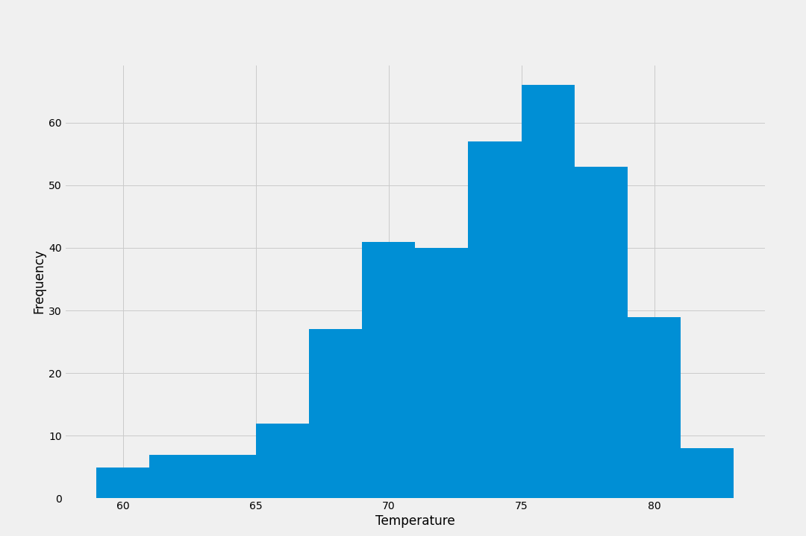

# SQLAlchemy Challenge: Surf’s Up

This Analysis has two parts:

## Analyze and Explore the Climate Data

In this part of the analysis, 

* The previous 12 months of precipitation data

* The total number of stations in the dataset.

* The most-active stations

* The lowest, highest, and average temperatures of the most-active station id found in the previous query.

* The previous 12 months of temperature observation (TOBS) data of the most active station

## Design Your Climate App

A Flask API based on the queries that has been just developed was created.
